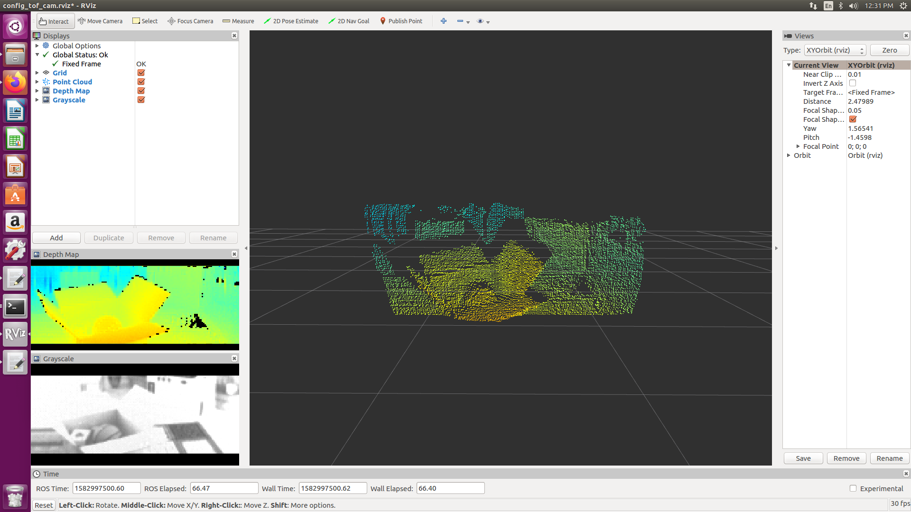
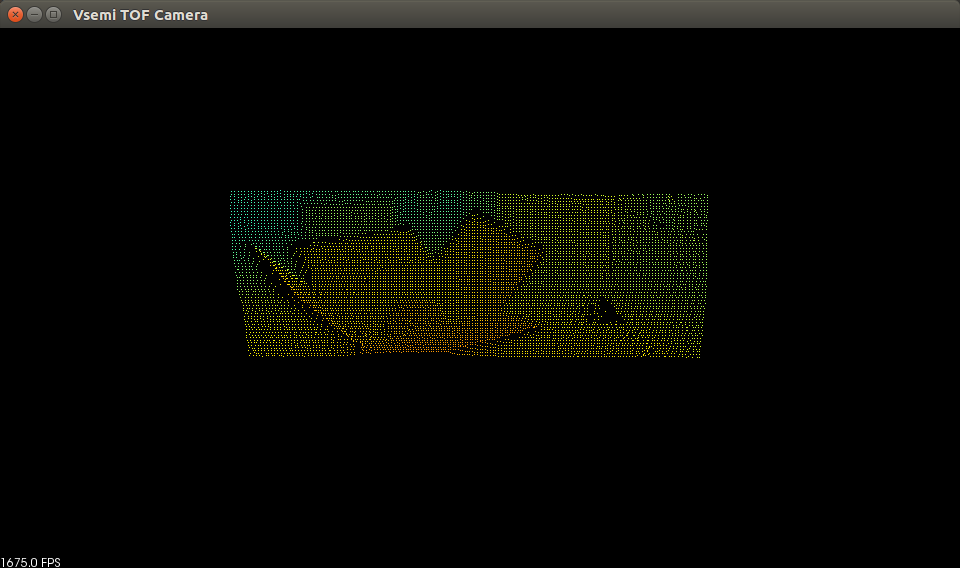

## VSEMI TOF SDK 1.3.5
Visionary Semiconductor Inc.
Feb 29, 2020

## Introduction

   **VSEMI ToF SDK** is the development kit for Sentinel-V3 ToF camera, developed by Visionary Semiconductor Inc.

   Built with the Time-of-Flight (**ToF**) depth vision technology, Sentinel-V3 was designed for reliable depth sensing with high accuracy. 
   It was developed for easy and fast development and/or deployment in real applications, such as robotics, drones, and automotives. 
   As a ToF 3D camera, **Sentinel-V3** does not require moving components and is thus robust and wear-free. 

## Sample applications:

**sample1**: work with raw data with minimum_dependency

**sample2**: work with depth map and point cloud in ROS environment

Point cloud with distance pseudo-color:

 
Point cloud with grayscale:


**sample3**:                   work with depth map and point cloud using OpenCV and PCL

The point cloud:


**sample4**:                   work with depth map, point cloud and RGB camera in ROS environment

**sample5**:                   work with depth map, point cloud and RGB camera using OpenCV and PCL

**sample6**:                   work with depth map with OpenCV

## Quick start:

**Minimum settings**
```
static Settings settings;
void initConfig()
{
	settings.mode = 0; /*! 0 for wide FOV, and 1 for narrow beam */
	settings.hdr  = 2; /*! 0 HDR off, 1 for HDR spatial and 2 for HDR temporal */
	settings.frameRate = 50.0; /*! frame rate, this can be changed at runtime, for example 30.0 */
	settings.automaticIntegrationTime = true; /*! true for auto integration time, false to turn off auto integration time */

	settings.roi_leftX   = 0;   /*! 0 - 160 (image width)  region of interest left   x */
	settings.roi_topY    = 0;   /*! 0 -  60 (image height) region of interest top    y */
  
	settings.roi_rightX  = 159; /*! 0 - 160 (image width)  region of interest right  x */
	settings.roi_bottomY = 59;  /*! 0 -  60 (image height) region of interest bottom y */

	settings.roi_rightX  -= (settings.roi_rightX - settings.roi_leftX + 1) % 4;
	settings.roi_bottomY -= (settings.roi_bottomY - settings.roi_topY + 1) % 4;

	settings.range  = 4000; /*! 0 - 9000, the depth range in mm, for coloring the BGR depth map and the 3D points */

	settings.startStream = true; /*! true to start ToF sensor */
	settings.runVideo    = true;    /*! true to start ToF sensor */
	settings.updateParam = true; /*! true to start ToF sensor */
}
```

Subscribe ToF camera image:
```
void update_tof_image_visualize(std::shared_ptr<ToF_Image> tof_image)
{
	cout << "Image width: " << tof_image->width << " height: " << " points: " << tof_image->n_points << endl;
	// do something for the data below:
	//tof_image->data_3d_xyz_rgba;
	//tof_image->data_depth
	//tof_image->data_2d_bgr
	//data_3d_xyz_rgb
	for (int i = 0 ; i < tof_image->n_points; i ++)
	{
		float distance = tof_image->data_depth[i];
		cout << "     distance of point: " << i << ": " << distance << endl;
	}
}
```

The main function:
```
int main() {
	cout << "Vsemi TOF Camera is starting ..." << endl;
  
	initialise();
  
	/**
	* Create driver instance, and init communication
	*/
	ToF_Camera_Driver tof_camera_driver(settings);

	bool initiated = tof_camera_driver.initCommunication();

	if (! initiated)
	{
		return 1;
	}

	/**
	* Connect signal to obtain ToF_Imagem which contains data include raw distance data array, colored depth data array and 3D points data array.
	*/
	tof_camera_driver.sig_tof_image_received.connect(boost::bind(&update_tof_image_visualize, _1));

	while (true)
	{
		/**
		* To request update, either requesting update parameters (in case settings changed at runtime) or requesting new frame
		*/
		tof_camera_driver.update();

		usleep(1);
	}

	return 0;
}
```

To be started, please read instructions in docs folder to build and run the sample applications.
